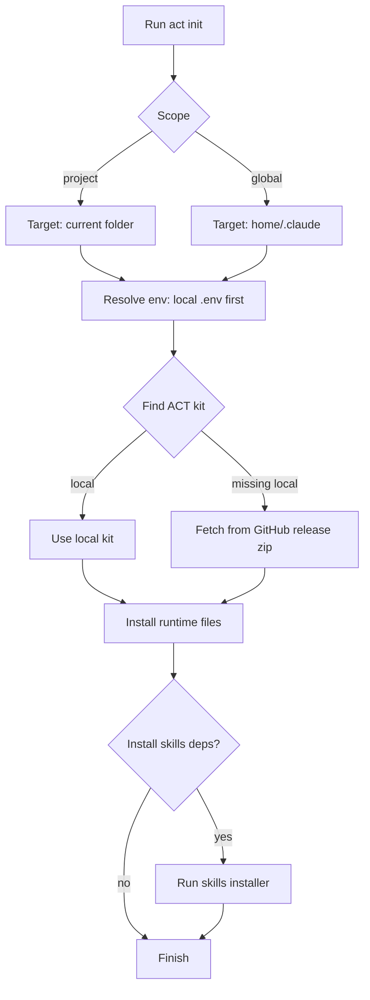
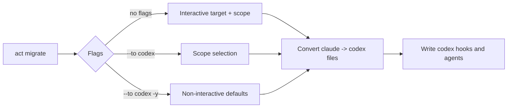

# act-cli

`act-cli` is the command-line runtime manager for ACT projects.
It installs and updates `.claude` runtime content, migrates projects, and keeps your local CLI up to date.

## What You Can Do
- Initialize runtime into the current project or global home scope
- Pull ACT kit from local path or GitHub release automatically
- Migrate `.claude` projects to `.codex` layout
- Run health checks
- Self-update CLI binary from GitHub releases

## Quick Start

### 1) Install `act`

Linux/macOS/Git Bash:
```bash
curl -fsSL https://raw.githubusercontent.com/khoipn21/act-cli/main/scripts/install.sh | bash
```

Windows PowerShell:
```powershell
irm https://raw.githubusercontent.com/khoipn21/act-cli/main/scripts/install.ps1 | iex
```

Verify:
```bash
act versions
```

### 2) Initialize Runtime in Current Project
Interactive wizard:
```bash
act init
```

Non-interactive defaults:
```bash
act init -y
```

### 3) Check and Update CLI
```bash
act update --check
act update
```

## Runtime Initialization Flow



## Command Reference

- `act new <dir> [--kit <path>] [--force]`
- `act init [target-dir] [--kit <path>] [--kit-repo <owner/repo>] [--force] [--scope project|global] [--global|-g] [--project] [--interactive|-i] [--non-interactive] [--yes|-y] [--install-skills-deps|--skip-skills-deps]`
- `act migrate [target-dir] [--to codex] [--scope project|global] [--global|-g] [--project] [--yes|-y] [--kit <path>] [--force]`
- `act doctor`
- `act config [list|get|set]`
- `act skills [list]`
- `act agents [list]`
- `act commands`
- `act plans [validate] [plan.md]`
- `act versions`
- `act update [--check]`

## Init and Scope Behavior

- Default scope is `project`
- Use `--global` or `-g` for global installation
- `--yes` / `-y` runs non-interactive defaults
- Wizard mode is default when terminal is interactive
- `init` env precedence:
  1. Target folder `.env`
  2. Global shell profile env (`~/.bashrc`, `~/.zshrc`, `~/.profile`, etc.)

## Migrate to Codex



Migration writes:
- `.codex/agents/*.toml` and managed `[agents.*]` registry in `.codex/config.toml`
- `.codex/hooks.json` from `.claude/settings.json` hooks
- `.codex/hooks/*-wrapper.cjs` compatibility wrappers
- `[features] hooks = true` in `.codex/config.toml`

## Tokens for Private Repos

If your kit repository is private, set one of:
- `ACT_GITHUB_TOKEN` (preferred)
- `GITHUB_TOKEN`
- `GH_TOKEN`

## Troubleshooting

- Wrong command target in PowerShell:
  ```powershell
  Get-Command act -All
  ```
- Re-check local setup:
  ```bash
  act doctor
  ```

## Project Docs

- `docs/project-overview-pdr.md`
- `docs/code-standards.md`
- `docs/codebase-summary.md`
- `docs/system-architecture.md`
- `docs/project-roadmap.md`
- `docs/deployment-guide.md`
- `docs/design-guidelines.md`
