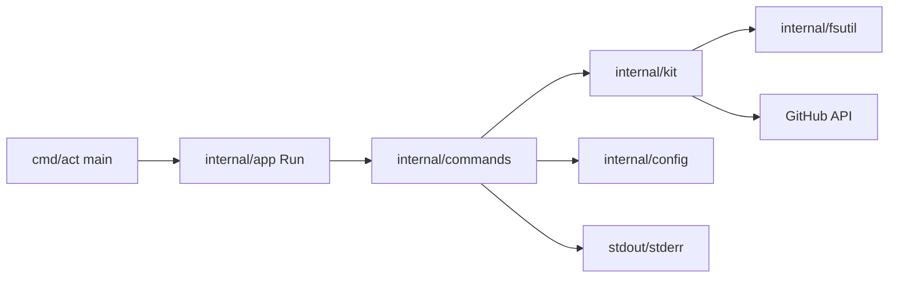

# System Architecture

## High-Level Components

## Runtime Interaction Model
- `main` delegates to `app.Run(args, stdout, stderr)`.
- `app.Run` dispatches first argument to command handlers.
- Command handlers parse flags and call domain services (`kit`, `config`, `fsutil`).
- Domain services execute filesystem and network operations, then return errors upward.

## Module Responsibilities
- `internal/app`
- Command routing and passive auto-update notice rendering.

- `internal/commands`
- User command implementations.
- Argument parsing and wizard UIs.
- Output formatting and operation summaries.

- `internal/kit`
- Runtime installation (`.claude`, docs, plan templates).
- Codex migration (`.codex` directories, agents, hooks, config merge).
- Kit source preparation via local resolution or GitHub download/extract.

- `internal/config`
- Persistent key-value config storage in user home.

- `internal/fsutil`
- Recursive copy primitive with optional overwrite behavior.

## Data and Artifact Paths
- Local runtime target: `<project>/.claude`
- Global runtime target: `<home>/.claude`
- Codex target: `<target>/.codex/*` + `AGENTS.md`
- Config store: `<home>/.act/config.json`

## Integration Points
- GitHub REST API
- Latest release lookup and asset download for self-update.
- Kit repository access checks and zip retrieval for `act init` fallback.

## Risk Areas
- Remote fetch failures (token/access/rate limits).
- Cross-platform binary replacement semantics on Windows.
- Migration correctness for hooks/agent conversion parity.